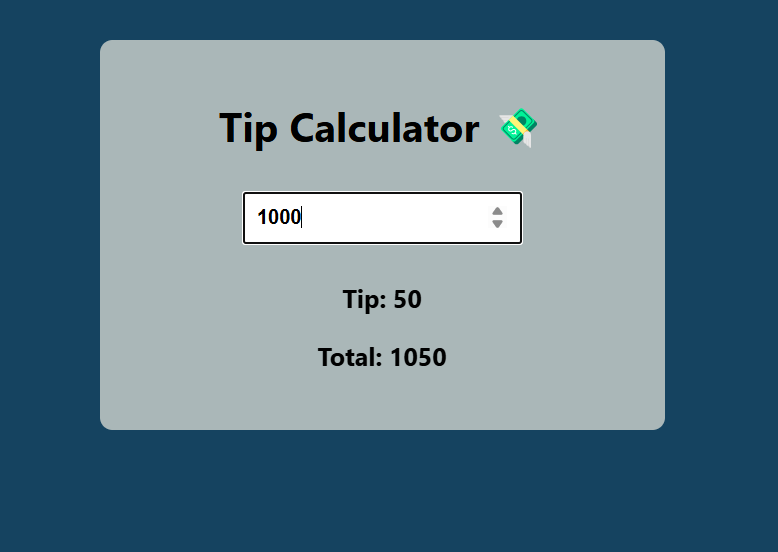

 
 
 # 💰 Tip Calculator

A simple **React** application that helps users calculate a tip based on their purchase amount. If a purchase is above **KES 1000**, a **KES 50** tip is added for every **KES 1000** spent.

---

## 📌 Features
- ✅ **Auto Tip Calculation**: Instantly calculates a tip for every KES 1000 above the threshold.
- ✅ **Dynamic Input**: Users can type any amount and see the tip and total update in real time.
- ✅ **Clean UI**: Minimal and straightforward layout using basic CSS.
- ✅ **Beginner Friendly**: Perfect for React learners and small utility apps.

---

## 🛠️ Technologies Used
- ⚛️ **React** (`useState` for managing input and calculation)
- 🎨 **CSS** (`tip.css` for basic styling)
- 📄 **HTML** (JSX structure inside React component)

## 🚀 Live Demo
To see it in action, clone the repository and follow the setup instructions below.

1. **Clone the repository:**

   ```bash
   git clone https://github.com/Eshhaa11/tip-calculator
   
   
2. **Navigate to the project directory:**

   cd  tip-calculator

3. **Install dependencies:**

   npm install

4. **Start the development server:**

   npm start

5. **Open your browser and visit:**

   http://localhost:3000

---

 ## 🎨 Screenshots:
 

 ---

 ## 🤝 Contributing:
 Want to improve this project? Fork the repository, create a feature branch, and open a pull request. All contributions are welcome! 🚀✨
 
 ---

 🎉 Happy Coding!